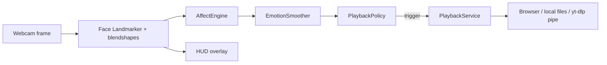

# Face Mood Music Player

**Affect-aware desktop music** driven by your webcam: **perception → affect inference → temporal fusion → playback policy → audio**.  
Version 2 uses **MediaPipe Face Landmarker** with **52 ARKit-style blendshape** scores as the primary signal, **geometry heuristics** as fallback, then **sliding-window smoothing** and a **cooldown policy** so playback does not thrash on noisy frames.

---

## Table of contents

1. [Architecture](#architecture-v2)
2. [End-to-end pipeline](#end-to-end-pipeline)
3. [Playback routing](#playback-modes-musicsource)
4. [Configuration reference](#configuration-reference)
5. [External services & system tools](#external-services--system-tools)
6. [GUI and CLI](#gui-control-panel)
7. [Supported platforms](#supported-platforms)
8. [Installation](#installation--setup)
9. [Running](#run-the-application)
10. [Keyboard shortcuts](#keyboard-controls)
11. [Troubleshooting](#troubleshooting)
12. [Project structure](#project-structure)
13. [Development](#development)
14. [Resume / portfolio copy](#resume--portfolio-copy)
15. [License & acknowledgments](#license)

---

## Architecture (v2)

| Layer | Package | Role |
|--------|---------|------|
| **Domain** | `facemood/domain` | Shared value types (`EmotionEstimate`, observations) |
| **Perception** | `facemood/perception` | BlazeFace + full-frame **Face Landmarker** — 478 landmarks + 52 blendshape scores; tolerant to multiple MediaPipe result shapes |
| **Affect** | `facemood/affect` | Blendshape → coarse emotion scores; optional landmark geometry path |
| **Temporal** | `facemood/affect/temporal.py` | Rolling window + EMA-style confidence smoothing before policy input |
| **Policy** | `facemood/policy` | Stable-frame gate, minimum confidence, cooldown, neutral “left mood” reset for re-triggering |
| **Playback** | `facemood/playback` | `PlaybackService`: browser URLs (YouTube / Spotify / SoundCloud), local folders, or **yt-dlp** stream + pygame / ffplay / mpv |
| **Audio** | `facemood/audio` | `MusicPlayer`: pygame mixer with **ffplay** / **mpv** fallback when SDL mixer is unavailable |
| **Session** | `facemood/session.py` | `FaceMoodSession` wires the full loop for **CLI** and **GUI** |
| **HUD** | `facemood/hud_overlay.py` | Optional futuristic on-frame overlay (emotion, confidence, source tag) |
| **Telemetry** | `facemood/telemetry.py` | Per-session affect distribution and play triggers |

Configurable via `config.json` (merged with defaults in `facemood/config.py`).

### Diagram (logical flow)



---

## End-to-end pipeline

1. **Frame ingestion** — OpenCV captures BGR frames; inference is throttled by `emotion.update_interval` (~8 Hz default) to cap CPU/GPU use.
2. **Perception** — `FaceAnalysisService` runs MediaPipe **Face Landmarker** on the **full frame** (consistent with training). Outputs normalized landmarks and blendshape dict when a face is present.
3. **Affect** — `AffectEngine` maps blendshapes (and optional geometry rules) to a label in `{happy, sad, surprised, angry, neutral}` plus a confidence score.
4. **Temporal** — `EmotionSmoother` applies a fixed window length and EMA-style smoothing; drops low-confidence frames below `temporal.min_confidence`.
5. **Policy** — `PlaybackPolicy` requires **N** consecutive stable frames (`policy.stable_frames`), confidence ≥ `policy.min_confidence`, and respects `policy.cooldown_seconds` between plays. Neutral dwell can reset the “last mood” latch via `neutral_reset_frames`.
6. **Playback** — On trigger, `PlaybackService.play_emotion` routes by `music.source` (browser search resolution, local shuffle, or streaming queue). In-app audio pipes are stopped before new browser opens where applicable to avoid stacked streams.

---

## Playback modes (`music.source`)

| Value | Behavior |
|--------|----------|
| `youtube_browser` *(default)* | See **`music.youtube_browser_mode`** below. Uses **yt-dlp** to resolve search → watch URL, in-app audio pipe, or plain search. |
| `spotify_browser` | Prefer **direct track URL**: optional **Spotify Web API** (Client Credentials: `spotify_client_id` / `spotify_client_secret`); else **Songlink/Odesli** from first **YouTube** search hit; else Spotify **search** page. |
| `soundcloud_browser` | **yt-dlp** `scsearch1:` → first result’s real **SoundCloud** `webpage_url`; fallback to SoundCloud search. |
| `local` | Audio files under `music/<emotion>/` (nested per affect class). |
| `youtube_stream` | **yt-dlp**-backed queue + pygame or external player (`MusicPlayer`). |

### `music.youtube_browser_mode` (when `source` is `youtube_browser`)

| Mode | What happens |
|------|----------------|
| **`watch`** *(default)* | `yt-dlp` resolves `ytsearch1:…` → `youtube.com/watch?v=…&autoplay=1`. Browsers may still block autoplay until user interacts once. |
| **`audio`** | **No browser** — `yt-dlp` stdout piped to **ffplay** or **mpv** (requires **ffmpeg** / **mpv** on `PATH`). Best for reliable in-app audio. |
| **`search`** | Opens the **YouTube search results** page only. |

For **reliable in-app playback** without relying on browser autoplay, prefer **`audio`** or **`youtube_stream`**.

### Browser behavior notes

- **`music.browser_open_new_tab`** — `false` (default) maps to `webbrowser.open(..., new=0)` (same window when the OS allows); `true` forces a new tab where supported.
- **No embedded browser engine** — playback uses the system default browser via Python’s `webbrowser` module. Tab reuse and autoplay are ultimately controlled by the browser, not this app.

### Custom emotion → search queries

`music.emotion_queries` in `config.json` can override default query lists per emotion (see `facemood/playback/service.py` `DEFAULT_QUERIES`). Empty `{}` uses built-in defaults.

---

## Configuration reference

All keys are read through `Config.get("dotted.path")`. Top-level sections:

### `camera`

| Key | Default | Description |
|-----|---------|-------------|
| `device_id` | `0` | OpenCV capture index |
| `width` / `height` | `1280` / `720` | Requested resolution |

### `face_detection`

| Key | Default | Description |
|-----|---------|-------------|
| `min_detection_confidence` | `0.5` | Face detector threshold |
| `min_tracking_confidence` | `0.5` | Tracker threshold |

### `emotion`

| Key | Default | Description |
|-----|---------|-------------|
| `update_interval` | `0.12` | Seconds between affect inferences when a face is present |
| `happy` / `sad` / `surprised` / `angry` | objects | Per-emotion geometry thresholds (fallback path) |

### `temporal`

| Key | Default | Description |
|-----|---------|-------------|
| `window` | `7` | Smoothing window length |
| `ema_alpha` | `0.42` | EMA blend for confidence |
| `min_confidence` | `0.38` | Minimum confidence to contribute to smoothed output |

### `policy`

| Key | Default | Description |
|-----|---------|-------------|
| `stable_frames` | `12` | Frames the label must be stable before a trigger is allowed |
| `cooldown_seconds` | `22.0` | Minimum time between playback triggers |
| `min_confidence` | `0.42` | Policy-side confidence floor |
| `neutral_reset_frames` | `8` | Neutral streak length to reset “last mood” for re-triggering |

### `music`

| Key | Default | Description |
|-----|---------|-------------|
| `source` | `youtube_browser` | One of `youtube_browser`, `spotify_browser`, `soundcloud_browser`, `local`, `youtube_stream` |
| `base_path` | `music` | Root folder for local playlists |
| `volume` | `0.7` | Mixer volume |
| `fade_duration` | `1.0` | Crossfade seconds (local/pygame path) |
| `supported_formats` | list | e.g. `.mp3`, `.wav`, `.ogg`, `.flac` |
| `prefer_streaming` | `true` | For `youtube_stream`, prefer yt-dlp stream vs local cache when applicable |
| `emotion_queries` | `{}` | Optional per-emotion query string lists |
| `youtube_browser_mode` | `watch` | `watch` \| `audio` \| `search` |
| `browser_open_new_tab` | `false` | Browser `new=` hint for `webbrowser` fallback |
| `spotify_client_id` / `spotify_client_secret` | `null` | Optional Spotify **Client Credentials** for track URLs |

### `display`

| Key | Default | Description |
|-----|---------|-------------|
| `show_landmarks` | `true` | Draw face landmarks |
| `landmark_color` / `landmark_size` | `[0,255,0]` / `2` | Landmark style |
| `font_scale` / `font_color` / `font_thickness` | … | HUD text |
| `futuristic_hud` | `true` | Stylized HUD |

### `logging`

| Key | Default | Description |
|-----|---------|-------------|
| `level` | `INFO` | Log level |
| `file` | `facemood.log` | Log file name |
| `console` | `true` | Mirror logs to stderr |

---

## External services & system tools

| Component | Purpose |
|-----------|---------|
| **yt-dlp** | Resolves YouTube `ytsearch1`, SoundCloud `scsearch1`, streaming audio; required for watch-mode URLs and SoundCloud first-hit resolution. |
| **ffmpeg (`ffplay`)** / **mpv** | External playback when pygame mixer is missing or for `youtube_browser_mode: audio`. |
| **requests** | HTTP for Spotify token + Songlink/Odesli lookup. |
| **Spotify Web API** *(optional)* | Client Credentials flow — search tracks, return `open.spotify.com` URLs. Register an app at [Spotify Developer Dashboard](https://developer.spotify.com/dashboard). |
| **Songlink / Odesli** *(optional fallback)* | `GET https://api.song.link/v1-alpha.1/links?url=...` — maps a YouTube URL to other platforms when metadata exists (Spotify link not guaranteed for every track). |

---

## GUI (control panel)

```bash
pip install -r requirements.txt
pip install -e .
facemood-gui
# or: PYTHONPATH=src python -m facemood.gui
```

- **Live** tab: start/stop camera, preview with HUD.  
- **Playback & camera** tab: music source, YouTube mode, local library root, camera index; **Save** writes `config.json`.

On Linux/Wayland, Qt may warn about OpenCV; the app sets `QT_QPA_PLATFORM=xcb` where applicable before OpenCV import (see `facemood/gui/app.py` / CLI).

---

## Features (summary)

- **Blendshape-first affect** — Uses ARKit-style blendshape weights when available  
- **Temporal fusion** — Reduces jitter before policy decisions  
- **Explicit policy layer** — Separates perception from “when to change music”  
- **Multiple backends** — Browser delegation, local files, yt-dlp streaming, in-app pipe  
- **PyQt6 GUI** — Settings + live preview  
- **Session telemetry** — Affect distribution and play counts  
- **Cross-platform** — Linux (including **Raspberry Pi**), Windows, macOS (see [Supported platforms](#supported-platforms))

---

## Supported platforms

The stack is **portable Python**: anywhere you can install **Python 3.9+** and the dependencies from `requirements.txt`, you can run the app—typically in a **virtual environment** (venv is **not** shipped with the repo; `.gitignore` excludes `venv/`, `.venv/`, etc.).

| Platform | Notes |
|----------|--------|
| **Linux (x86_64 / ARM64)** | Primary environment. Camera via **V4L2** (`/dev/video*`); audio via PulseAudio/PipeWire or ALSA. |
| **Windows / macOS** | Supported; grant camera/microphone permissions when prompted. |
| **Raspberry Pi** (Pi 4 / 5 with **4GB+ RAM** recommended) | **Yes — not limited to “powerful PCs.”** MediaPipe Face Landmarker is **CPU-bound**; on Pi you will get **lower FPS** than on a desktop. **Mitigations:** lower `camera.width` / `camera.height` in `config.json` (e.g. 640×480), increase `emotion.update_interval` to reduce inference rate, prefer **`music.source`: `local`** or **`youtube_browser_mode`: `audio`** over heavy browser + yt-dlp work. Install **`ffmpeg`** / **`mpv`** on the Pi for in-app audio fallbacks. **PyQt6** (`facemood-gui`) needs a **graphical desktop**; for **headless** setups use the **CLI** only (`facemood-player` / `python -m facemood.app`) and rely on local or pipe playback. |

**Embedded / SBC caveats:** Prebuilt **wheels** for OpenCV, MediaPipe, Pygame, and PyQt6 exist for **many** ARM boards but not all; if `pip install` fails, use a [Pi OS](https://www.raspberrypi.com/software/) image with recent Python or build from source only as a last resort.

---

## Installation & Setup

### Prerequisites

- **Python 3.9+** (3.11/3.12 recommended; very new versions e.g. 3.14 may lack prebuilt pygame wheels with mixer)
- Webcam
- Audio output
- **yt-dlp** (Python package in `requirements.txt`; optional system `yt-dlp` binary)
- For in-app pipe mode: **ffmpeg** (includes `ffplay`) and/or **mpv**

### Clone and install

```bash
git clone https://github.com/iceman404/facemood_music_player.git
cd facemood_music_player
pip install -r requirements.txt
pip install -e .
```

### Local music layout

```
music/
├── happy/
├── sad/
├── surprised/
├── angry/
└── neutral/   # optional, depending on your rules
```

---

## Run the application

```bash
PYTHONPATH=src python -m facemood.app
# or after pip install -e .
facemood-player
```

Useful flags (see `facemood/app/application.py`): `--config`, `--music-path`, `--no-streaming`.

Legacy script if present: `python facemood_player.py`.

---

## Keyboard controls

| Key | Action |
|-----|--------|
| **q** | Quit |
| **s** | Statistics summary |
| **p** | Pause / resume music |
| **+** / **=** | Volume up |
| **-** | Volume down |
| **t** | Toggle streaming vs local (when applicable) |
| **n** | Skip / re-queue current mood |

---

## Troubleshooting

### `NotImplementedError: mixer module not available`

Pygame was built **without SDL2 mixer** (common on bleeding-edge Python). The app **falls back to ffplay or mpv** if on `PATH` (install **ffmpeg**; on Arch/Manjaro: `sudo pacman -S ffmpeg`).

To force pygame mixer: install **sdl2_mixer** and reinstall pygame, or use a **3.11/3.12** venv with official wheels.

### Camera not working

- Free the device from other apps; try `device_id` `0`, `1`, `2` in `config.json`
- Check OS privacy permissions for camera

### No music / wrong source

- **Local**: verify folders under `music/<emotion>/` and supported extensions  
- **Browser**: ensure **yt-dlp** works for your network; Spotify may need **API credentials** for reliable track URLs  
- **Logs**: see `facemood.log` and console if enabled

### Poor emotion detection

- Lighting and face size in frame matter; tune `emotion.*` and `policy.*` thresholds from observed behavior

### Spotify always opens search

Without **Client Credentials**, Songlink may not map every YouTube hit to Spotify. Set `music.spotify_client_id` and `music.spotify_client_secret` in `config.json`.

---

## Project structure

```
facemood_music_player/
├── src/facemood/
│   ├── domain/           # Types
│   ├── perception/       # MediaPipe face + blendshapes
│   ├── affect/           # Inference + temporal smoother
│   ├── policy/           # Playback gating
│   ├── playback/         # PlaybackService (browser / yt-dlp)
│   ├── audio/            # MusicPlayer (pygame / ffplay / mpv)
│   ├── gui/              # PyQt6
│   ├── app/              # CLI entry
│   ├── session.py        # FaceMoodSession pipeline
│   ├── hud_overlay.py
│   ├── config.py
│   ├── utils.py
│   └── telemetry.py
├── music/                # Local playlists by emotion
├── config.json
├── requirements.txt
├── setup.py
└── README.md
```

---

## Development

- **Run from source**: `PYTHONPATH=src python -m facemood.app` or `facemood-gui` after `pip install -e .`
- **Style**: Match existing modules; keep playback and perception concerns separated
- **Tests**: Add targeted tests under a `tests/` package if you extend extractors or policy

### Extending

- New **music source**: implement routing in `facemood/playback/service.py` and expose in `config.py` + GUI `SOURCES`
- New **emotion**: extend `AffectEngine`, defaults in `config.py`, local `music/<label>/`, and normalization in `utils.py`
- **Headless API**: instantiate `FaceMoodSession` with a `Config` and feed frames from tests or a file

---

## Resume / portfolio copy

Use the blocks below on a resume, LinkedIn, or portfolio site. Adjust tense and team wording to match your situation.

### Technologies Used

- **Languages & runtime:** Python 3.9+
- **Computer vision:** OpenCV, Google MediaPipe (Face Landmarker, BlazeFace), NumPy
- **Desktop UI:** PyQt6
- **Audio:** Pygame (SDL2 mixer) with **ffplay** / **mpv** fallback pipelines
- **Networking & media:** `requests`, **yt-dlp** (YouTube / SoundCloud resolution, streaming), optional **Spotify Web API** (OAuth2 Client Credentials), **Songlink/Odesli** REST API for cross-platform track linking
- **Architecture:** Layered pipeline (perception → affect → temporal smoothing → policy → playback), shared `FaceMoodSession` for CLI/GUI, JSON-driven configuration

### Description (short — one resume bullet)

Built an **affect-aware music player** that maps **live webcam facial cues** (MediaPipe **blendshape** scores and geometric heuristics) to **emotion labels**, applies **temporal smoothing** and a **cooldown-based playback policy**, and routes output to **local files**, **browser-based** streaming services (YouTube / Spotify / SoundCloud resolution via **yt-dlp** and optional APIs), or **in-app audio** via **yt-dlp** pipes to **ffplay/mpv**; shipped a **PyQt6** control panel and a **CLI** with configurable thresholds and session telemetry.

### Description (paragraph — project detail section)

**Face Mood Music Player** is a desktop Python application that closes the loop from **real-time face analysis** to **music playback**. It uses **MediaPipe Face Landmarker** to extract **ARKit-style blendshape** activations and optional landmark geometry rules, then aggregates predictions over a **sliding window** with confidence gating. A dedicated **policy layer** enforces **stability**, **minimum confidence**, and **cooldown** constraints before triggering playback, reducing jitter from noisy frames. **PlaybackService** abstracts multiple backends: resolving **YouTube** and **SoundCloud** candidates through **yt-dlp**, optionally resolving **Spotify** track URLs via the **Spotify Web API** or **Songlink**, falling back to platform search pages when needed, alongside **local folder** libraries and **yt-dlp**-based streaming with **pygame** or external players. A **PyQt6** GUI provides live preview and settings; configuration is **JSON-driven** for tuning perception, policy, and audio behavior.

### Optional one-liners (skills tags)

`Computer Vision` · `Real-Time Systems` · `Human–Computer Interaction` · `Multimedia` · `API Integration` · `Software Architecture`

---

## License

This project is licensed under the **MIT License** — see [LICENSE](LICENSE).

## Acknowledgments

- **Google MediaPipe** for Face Landmarker and face detection models  
- **OpenCV** community  
- **yt-dlp** and **ffmpeg** ecosystems  
- **Spotify** and **Songlink/Odesli** where used for metadata and linking  

## Contributing

Contributions are welcome. Please keep changes focused, add logging where appropriate, and update this README when user-visible behavior changes.
